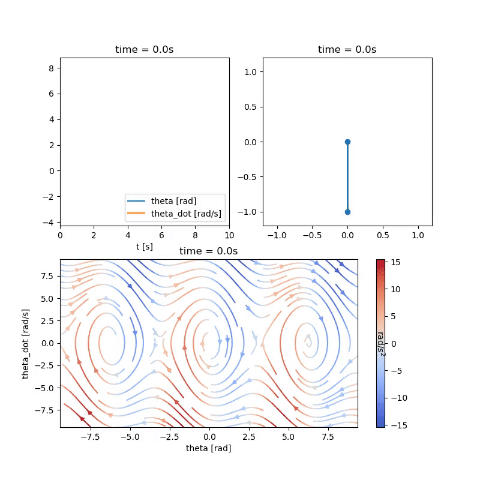

# Minimal ODE Euler solver + Matplotlib Animations 

## Requirements

* Numpy
* Matplotlib

## Output

Top-right: Damped Pendulum  
Top-left: Angle and angle velocity over time  
Bottom: Phase plot with color-coded angle acceleration  

